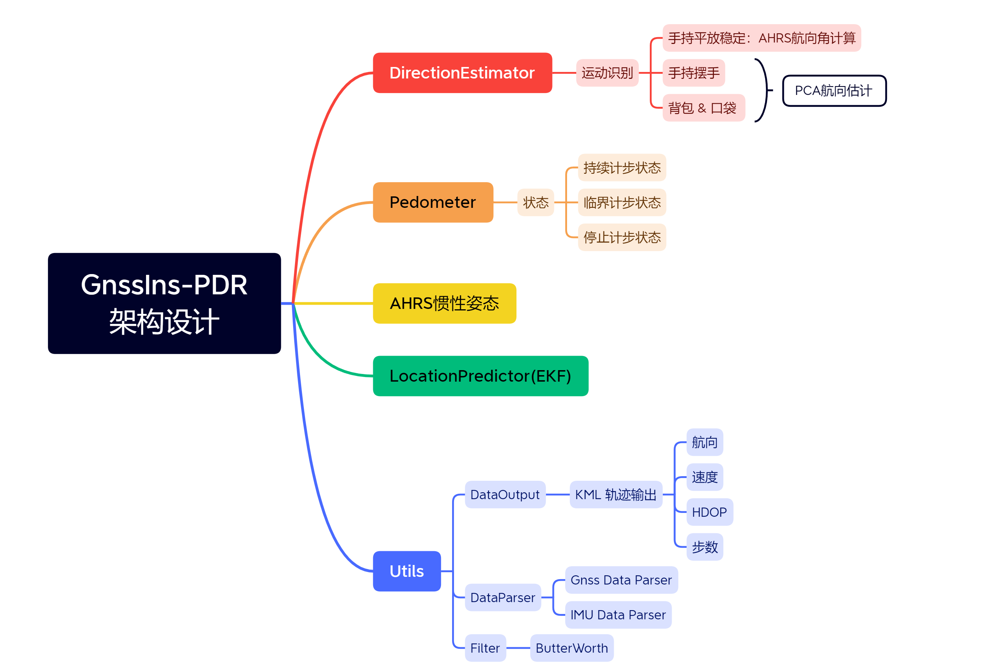

# 组合导航-行人航位推算

原理：利用IMU计算行人以及方向融合GNSS的方向，采用EKF进行融合滤波得到最优的位置估计。

## 一、概述

​		PDR算法的架构设计如下图所示：

## 二、效果比较（旧版PDR  vs 手机GNSS）

手机原始输出位置：

.png)

Gnss融合输出位置：

.png)

手机原始输出位置：

.png)

Gnss融合输出位置：

.png)

## 三、更新日志

2022-09-08 ： 创建仓库、添加仿真结果

2022-09-10 ： 更新新版PDR算法架构设计, 创建Visual Studio 工程